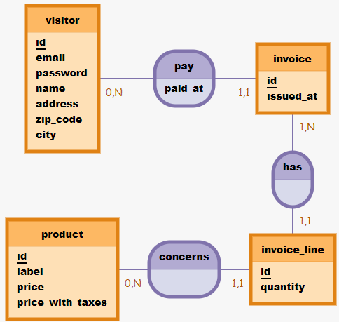
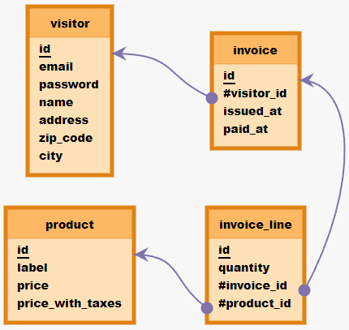
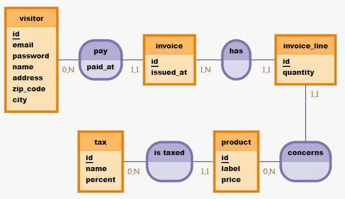
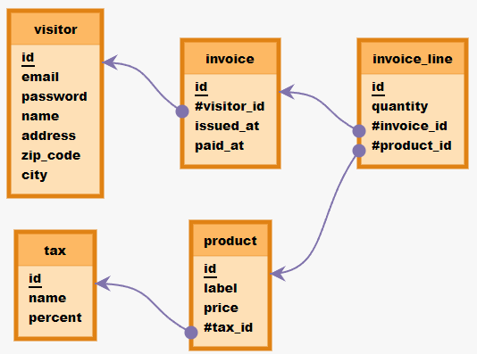

# oFact

## 1 - Création de la BDD

- Création d'un fichier [data/init_db.sql](data/init_db.sql) lancé avec la commande `psql -U postgres -f data/init_db.sql`.
- Création d'un dossier [migration](migration/)
- Initialisation de sqitch avec `sqitch init ofact --engin:pg -target db:pg:ofact`
- Création des fichiers [deploy.sh](migration/deploy/deploy.sh), [revert.sh](migration/revert/revert.sh), et [verify.sh](migration/verify/verify.sh) contenant les infos de connexion et la commande associé.
- Création du fichier [add_version.sh](migration/add_version.sh) pour la création des versions.
- Mise en place d'un test pour vérifier que tout fonctionne

  >J'ai laissé le OWNER de la database à postgres pour qu'elle appartiennent à un Super User. L'idéal aurait été de créer un autre Super User avec un mot de passe et de supprimer postgres. Pour les besoin de la formation, j'ai choisi de garder postgres pour me faciliter la vie.

## 2 - 1ère migration

- Reprise du MCD fourni pour en faire une version cohérente avec le seeding



- Création du MLD



- Ajout d'une version dans le fichier [add_version](migration/add_version.sh)
- Ecriture du code de la version `1.init` dans [deploy/,.init.sql](migration/deploy/1.init.sql), [revert/,.init.sql](migration/revert/1.init.sql), [verify/,.init.sql](migration/verify/1.init.sql)
- Ajouts de la contrainte `ON DELETE CASCADE` uniquement sur la FK invoce_id. En effet, si un jour on supprime un client, on ne veut pas supprimer les factures qui lui sont associées, d'un point de vue comptable cela pourrait être problématique. Si un jour on supprime un produit, on ne veut pas supprimer toutes les lignes de factures dans lesquelles il apparait. Par contre, lors de la suppression d'une facture, il est obligatoire de supprimer toutes les lignes de facture qui lui sont associées.
- Ajouts de la contrainte `UNIQUE` sur l'email du visteur et sur le label d'un produit. Cela évitera les doublons de compte client et de produit.
- Création des `DOMAINS`
  - email : `^([a-zA-Z0-9]+[-_.]?)*[a-zA-Z0-9]+@[a-zA-Z0-9]+[-]?[a-zA-Z0-9]+.[a-z]{2,}$`
  - password : `^\$2b\$` pour vérifier que le mot de passe soit bien hashé par bcrypt
  - price : `^[\d]+(.[\d]{1,2})?$`
  - zip_code : `^[\d]{5}$` 5 chiffres, le données sont fake et pourraient ne pas matcher avec une version complète d'un vrai vérification de zip_code
- Création des `INDEX`
  - `product_label_index` : On aura souvent besoin d'afficher les produits, et faire des recherche dedans a partir du label. J'utilise le type `hash` partant du principe qu'on utilisera cette méthode en égalité uniquement
  - `price_with_taxes_index` : On pourra être ammené à classes les produits en fonction du prix, faire des rechers de produits ne dépasssant pas un certain prix, j'ai donc choisi d'indexer cette colonne avec le paramètre par défaut `b-tree`.
  - `invoice_id_index` : Je ne sais pas si c'est une bonne pratique d'indexer une clé étrangère, mais j'imagine que lors de la consultation d'une fatcure, on ira chercher dans la table `invoice_line` l'ensemble des lignes avec `invoice_line.invoice_id` égal à l'id de la facture demandé. J'utilise donc la méthode hash

## 3 - 3ème forme normale

L'erreur ne respectant pas la 3e forme normale vient de la table product

| PRODUCT          |
|------------------|
| id               |
| label            |
| price            |
| price_with_taxes |

En effet, si on veut modifier le prix d'un produit, on devra mettre à jour 2 colonnes :
- `price`
- `price_with_taxes`

Mise à jour dans les fichiers :
- [migration/deploy/2.3fn.sql](migration/deploy/2.3fn.sql)
- [migration/revert/2.3fn.sql](migration/revert/2.3fn.sql)
- [migration/verify/2.3fn.sql](migration/verify/2.3fn.sql)
- [data/seeding_v2.sql](data/seeding_v2.sql)

J'ai crée une table `tax` dans laquelle j'insère les valeurs suivantes :

| id | name       | percent |
|----|------------|---------|
| 1  | TVA        | 20      |
| 2  | TVA réduite| 5.50    |

Pour ne pas perdre de data, je récupère pour chaque ligne de la table product la valeur de la tva calculé avec les prix HT et TTC, et je lui affecte l'id de la taxe correspondante.
Pour finir je supprime la column price_with_taxes.

Mise à jour du MCD


Mise à jour du MLD


## 4 - API SQL

- Création de la version pour le CRUD dans
  - [deploy/3.crud_function](migration/deploy/3.crud_functions.sql)
  - [revert/3.crud_function](migration/revert/3.crud_functions.sql)
  - [verify/3.crud_function](migration/verify/3.crud_functions.sql)
- J'ai du adapter l'email et le mot de passe de l'exemple pour qu'ils passent avec mes regex
- J'ai utiliser la fonction `CAST()` pour transformer les types des données. Dans le JSON elles sont en string (donc en TEXT), mais lorsque certaines colonnes demandent un autre type il faut les transformer, notamment au niveau des `WHERE id = CAST(body->>'id' AS INT)`
- Pour le bonus qui pique, voir dans les fichiers : 
  - [deploy/4.update_function_invoice.sql](migration/deploy/4.update_function_invoice.sql)
  - [revert/4.update_function_invoice.sql](migration/revert/4.update_function_invoice.sql)
  - [verify/4.update_function_invoice.sql](migration/verify/4.update_function_invoice.sql)
- J'ai ajouté `COALESCE` dans la fonction `update_invoice` au niveau de la ligne `paid_at`. Personnellement, je trouve un peu étrange la logique de ce bout de code, on aimerait plutot vouloir ignorer l'envoi de l'info de la date du paiement tant que le paiement n'est pas effectué. En aucun cas on voudra avoir une valeur par défaut sur une ligne dont la perticnence de l'info est aussi cruciale. Mais c'est demandé, on va pas chercher à comprendre pourquoi le client le veut comme ça...
- J'ai par ailleurs pris la liberté d'enlever la ligne `issued_at` de la fonction. En effet, cette ligne devrait logiquement se créer d'elle même à la date du jour lorsqu'elle est créée, et ne devrait plus jamais être modifiée. Pour garder la main sur cette ligne j'ai ajouté une autre fonction permettant de la mettre à jour.

Au final, on peut envoyer la requête avec uniquement les infos demandées :
```sql
SELECT * FROM update_invoice('{
    "visitor_id": "1",
    "id": 1
}');
```
La colonne `issued_at` ne sera pas changée, et la colonne `paid_at` sera rempli avec le résultat de `now()`

## 5 - Jointures

- Création de la version dans sqitch : 
  - [deploy/5.invoice_details.sql](migration/deploy/5.invoice_details.sql)
  - [revert/5.invoice_details.sql](migration/revert/5.invoice_details.sql)
  - [verify/5.invoice_details.sql](migration/verify/5.invoice_details.sql)

```sql
CREATE VIEW invoice_details AS
    SELECT visitor.name, city, invoice.id AS invoice_ref, issued_at, paid_at, quantity, label, price, percent AS taux_TVA, (price*(1+(percent/100))*quantity)::decimal(10,2) AS total
    FROM invoice_line
    JOIN product ON product_id = product.id
    JOIN tax ON tax_id = tax.id
    JOIN invoice ON invoice_id = invoice.id
    JOIN visitor ON visitor_id = visitor.id;
```
J'ai transformé le résultat en décimal à 2 chiffres après la virgule.

## 6 - Requêtes imbriquées (ou sous-requêtes ou subqueries)

- Création de la version dans sqitch : 
  - [deploy/6.invoice_recap.sql](migration/deploy/6.invoice_recap.sql)
  - [revert/6.invoice_recap.sql](migration/revert/6.invoice_recap.sql)
  - [verify/6.invoice_recap.sql](migration/verify/6.invoice_recap.sql)

```sql
CREATE VIEW invoice_recap AS
    SELECT
    invoice.id,
    issued_at,
    paid_at,
    (
        SELECT visitor.name
        FROM visitor
        WHERE visitor.id = invoice.visitor_id
    ) AS visitor,
    (
        SELECT SUM(total)
        FROM invoice_details
        WHERE invoice_ref = invoice.id
    ) AS total
    FROM invoice;
```

## 7 - L'art de la boucle en SQL

- Création de la version dans sqitch : 
  - [deploy/7.sales.sql](migration/deploy/7.sales.sql)
  - [revert/7.sales.sql](migration/revert/7.sales.sql)
  - [verify/7.sales.sql](migration/verify/7.sales.sql)

```sql
CREATE TYPE sales AS (date DATE, nb_invoices INTEGER, total NUMERIC);

CREATE FUNCTION sales_by_dates(date_from DATE, date_to DATE) RETURNS SETOF sales AS $$
	BEGIN
		RETURN QUERY (
			SELECT currentDate::DATE, COUNT(invoice_recap.id)::integer AS nb_invoices, SUM(invoice_recap.total)
			FROM generate_series(date_from::DATE, date_to::DATE, '1day') AS currentDate
			JOIN invoice_recap ON currentDate = issued_at::date
			GROUP BY currentDate
		);
	END
$$ LANGUAGE plpgsql;
```

Je n'ai pas réussi à ressortir les lignes des dates pour lesquelles il n'y a pas de facture. `COUNT` et `SUM` renvoyant déjà 0, l'utilisation de COALESCE est rendue inutile.

## Bonus poilu - Va te coucher Sequelize !! Attention ça pique ! 🌵🌵

- Création de la version dans sqitch : 
  - [deploy/8.packed_invoice.sql](migration/deploy/8.packed_invoice.sql)
  - [revert/8.packed_invoice.sql](migration/revert/8.packed_invoice.sql)
  - [verify/8.packed_invoice.sql](migration/verify/8.packed_invoice.sql)

```sql
CREATE TYPE packed AS (name TEXT, city TEXT, invoice_ref INTEGER, issued_at TIMESTAMPTZ, paid_at TIMESTAMPTZ, lines JSON[], total NUMERIC);

CREATE FUNCTION packed_invoice (invoiceId INTEGER) RETURNS SETOF packed AS $$
	BEGIN
		RETURN QUERY (
			SELECT invoice_recap.visitor AS name, invoice_details.city, invoice_recap.id AS invoice_ref, invoice_recap.issued_at, invoice_recap.paid_at, array_agg(json_build_object('quantity', quantity, 'label', label, 'price', price, 'taux TVA', taux_tva, 'total ligne', invoice_details.total)) AS lines, invoice_recap.total
			FROM invoice_recap
			JOIN invoice_details ON invoice_ref = invoice_recap.id
			WHERE invoice_recap.id = invoiceId
			GROUP BY invoice_recap.visitor, invoice_details.city, invoice_recap.id, invoice_recap.issued_at, invoice_recap.paid_at, invoice_recap.total
		);
	END;
$$ LANGUAGE plpgsql;
```

## Bonus de la mort - Attention ça pique fort !! 🌵🌵🌵

- Création de la version dans sqitch : 
  - [deploy/9.add_invoice.sql](migration/deploy/9.add_invoice.sql)
  - [revert/9.add_invoice.sql](migration/revert/9.add_invoice.sql)
  - [verify/9.add_invoice.sql](migration/verify/9.add_invoice.sql)

```sql
DROP FUNCTION add_invoice;

CREATE FUNCTION add_invoice (body JSON) RETURNS integer AS $$
	DECLARE
		prod record;
	BEGIN
		RETURN (
			SELECT id FROM insert_invoice(body)
		) AS invoiceId;

		FOR
			prod IN SELECT products FROM body
		LOOP
			SELECT * FROM insert_invoice_line(
				json_build_object(
					'quantity', (prod->>quantity),
					'invoice_id', invoiceId,
					'product_id', (prod->>id)
				)
			);
		END LOOP;
	END;
$$ LANGUAGE plpgsql;

SELECT id FROM add_invoice('{
    "issued_at": "2022-04-13 10:00:00+02", 
    "visitor_id": 1, 
    "products": [
        {
            "id": 1,
            "quantity": 5
        },
        {
            "id": 2,
            "quantity": 3
        }
    ]
}') AS id;
```

Le code ci dessus enregistre bien la nouvelle facture, mais ne crée pas les lignes dans la table `invoice_line`. Mais je m'arrête pour le coup, c'était hyper cool d'aller jusque là déjà.

## TODO
- remplacer la fonction CAST dans le point 4 par le système `::`